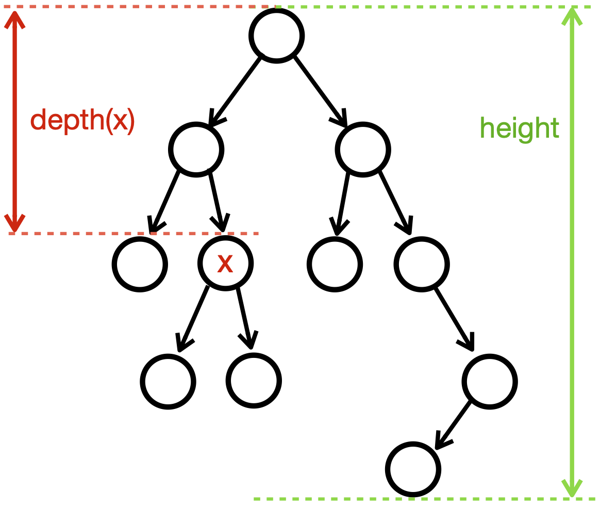

# Week 12

In this weeks lab, the goal is to get more comfortable creating and traversing binary search trees. You will need to calculate some values related to the tree itself or specific nodes in the tree. In particular you will calculate the size and height of the tree and the depth of a specific node. 



Remember that the height of the tree is the number of levels and the depth of a node is the number of edges from the root to that node (the depth of the root is 0). In the example above, the height of the tree is 4, and the depth of `x` is 2.

### Your task
Given an array of `int`s we want to create a new binary search tree by repeatedly inserting the elements of the array in the order in which they are given. 
We will also provide functions to recursively find the height of the while tree, and the depth of a specific element. 

The basic structure of your new `myBinarySearchTreeNode` class will be as follows:
```
class myBinarySearchTreeNode{
  int myValue;
  myBinarySearchTreeNode left;
  myBinarySearchTreeNode right;
    
  myBinarySearchTreeNode(int inValue){
    // created a new node with empty child pointers
  }
  
  myBinarySearchTreeNode(int[] A){
    // creates a new Binary Search Tree rooted at the first value in the array
    /// by inserting elements into the tree in the order they are given in A.
  }
  
  public void insert(int inValue){
    // This method takes a new integer as input and decides 
    // if it should be place: 
    //    * as the left child,
    //    * as the right child, 
    //    * in the left subtree,
    //    * or in the right subtree.
    // If the value already exists in the tree, no action is taken. 
  }
  
  public int height(){
     // This method recursively calculates the height of the entire (sub)tree.
     // This method will take O(n) time
  }
  
  public int depth(int search){
     // This method recursively calculates the depth of a given search value. 
     // If the given value is not in the tree, this method returns -1. 
     // Note that if the tree is a proper BST, this method should complete in O(log n) time.
     // Additionally, remember that the depth is the number of nodes on the path from a node to the root 
     // (i.e. the number of recursive calls).
  }
  
  public int size(){
     // This method recursively calculates the number of nodes in the (sub)tree.
  }
  
} 
```

### What do you have to do
1. Fill in the methods described above in the file `myBinarySearchTreeTester.java` using the comments to guide the construction of the methods. 
1. Test your class by creating at least *5 test cases using `JUnit`. For this you will create a new file called `myBinarySearchTreeTester.java`. You are expected to describe and justify each test case in a comment right before in the code. 

### What you should submit on Git
1. `myBinarySearchTreeNode.java`, and 
1. `myBinarySearchTreeTester.java`

### When
Due *Friday, 17 April 2020 @11:59pm*. <br />
Lateness rule: -10 pts for 1 day of lateness / - 20 pts for 2 days of lateness / 0 after that, but you still have to turn in your work. 


### Grading: 

* 70 pts  `myBinarySearchTreeNode` class
  * 20 pts  `myBinarySearchTreeNode(int[] A)`
  * 20 pts  `public void insert(int inValue)`
  * 10 pts  `public int height()`
  * 10 pts  `public int depth(int search)`
  * 10 pts  `public int size()`
* 30 pts	JUnit tests for method your binary tree in `myBinarySearchTreeTester.java `
  * 6 pts per test case
    * 3 pts for the justification and 
    * 3 pts for the implementation

### Suggested Schedule
Monday -- Create the test cases & the constructor <br />
Wednesday -- Create the search, and height methods & test. 
